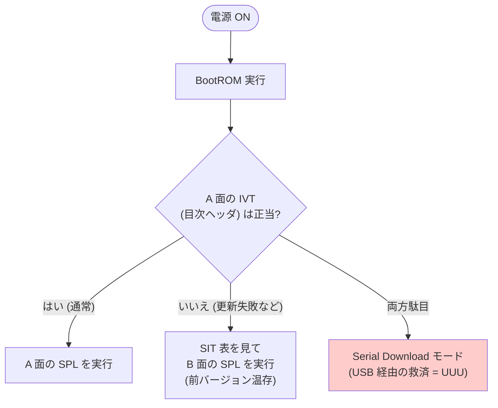
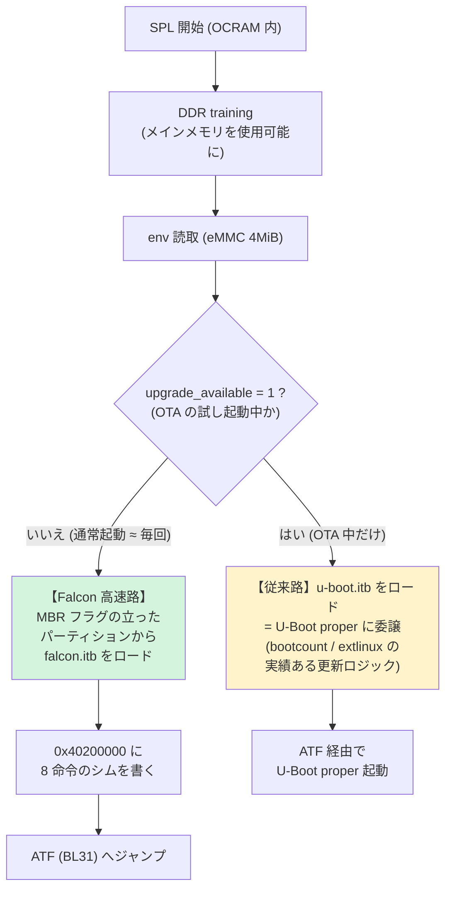
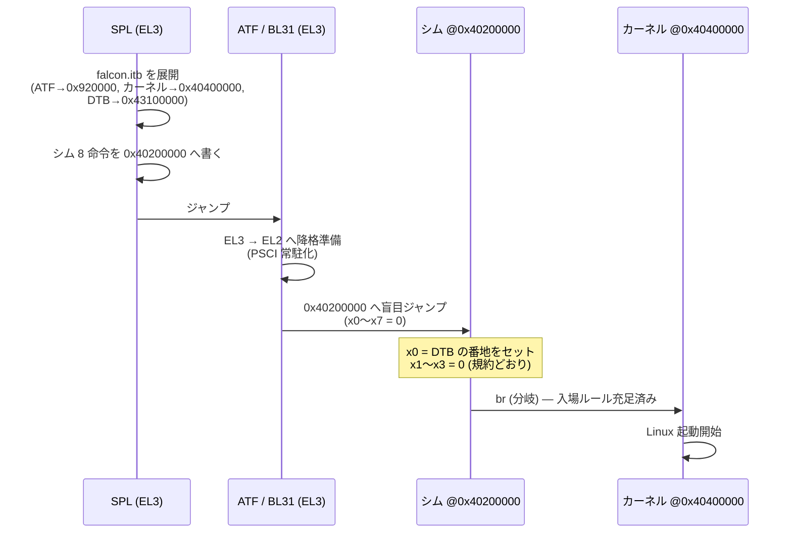
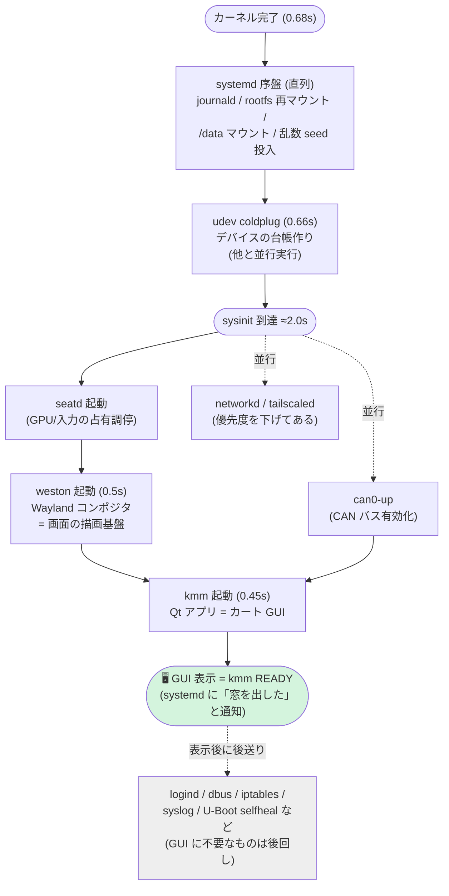
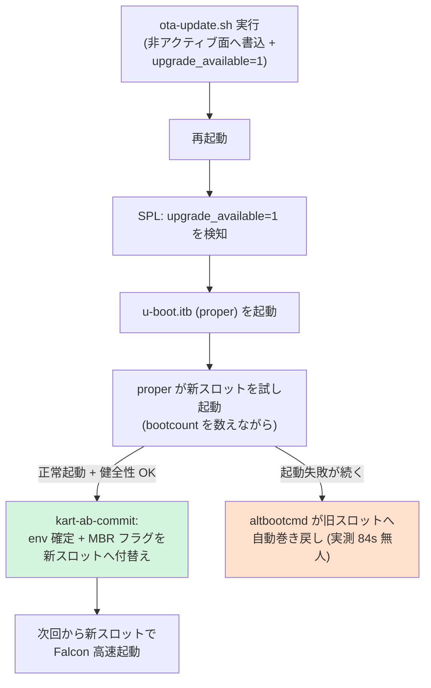
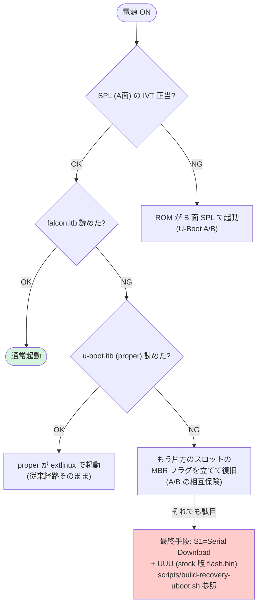

# 09 — ブートシーケンス完全解説(電源 ON → GUI 表示)

XPI-iMX8MM(kart 構成)が電源投入から GUI 表示(約 4.9 秒)に至るまでの
全段階を、初学者向けに一枚で解説する。用語は本文中と文末の
[用語ミニ辞典](#用語ミニ辞典)で注釈する。

実装の根拠: [08-falcon.md](08-falcon.md)(高速化設計)、
[04-pitfalls.md](04-pitfalls.md)(踏んだ罠)、05 の実測記録。

---

## 全体像 — 電源からGUIまでの旅

ブートとは「小さなプログラムが、より大きなプログラムを順番に呼び出していく
リレー」である。走者は 5 人いる:

各区間の実測時間(コールドブート N=5、2026-08-13):

| 区間 | 所要 | 何をしている時間か |
|---|---|---|
| 電源 → SPL 最初の出力 | ~1.1s | ROM の起動 + eMMC から SPL 読込 + **DDR training** |
| SPL(env 読取 + カーネル一式 21.5MB ロード + シム設置) | 0.25s | 下記②参照 |
| ATF(BL31) | 0.015s | CPU モード遷移だけ |
| カーネル起動 | 0.68s | ドライバ初期化・rootfs マウント |
| ユーザー空間 → GUI | 2.9s | systemd・weston・kmm |
| **合計(電源 → GUI)** | **≈4.9s** | |

---

## ① BootROM — 全ての始まり(変更不可能な領域)

SoC(i.MX8MM チップ)の中に**製造時に焼き込まれた小さなプログラム**。
電源が入ると CPU はまずここを実行する。書き換え不可能なので、
ここが「信頼の起点」になる。

やることは 1 つ: **ブート元(この構成では eMMC)から SPL を RAM ならぬ
SoC 内蔵の小さなメモリ(OCRAM/TCM)へコピーして実行する**。
まだ DDR(メインメモリ)は使えない — DDR を起こすのが次の SPL の仕事だから。

このとき ROM は SPL の先頭にある **IVT**(目次ヘッダ)だけを検査する。
IVT が壊れていたら **SIT** という表を頼りに予備コピー(B 面)へ
自動フォールバックする — これが「U-Boot 自体の A/B」の仕組み
([04-pitfalls](04-pitfalls.md) #19)。

> **応用 — S1 を触らず SDP に落とす**: このチェーンは逆手に取れる。
> **A/B 両面の IVT**(sector 0x42 / 0x1042 の各先頭セクタ)、または
> **A 面の IVT + SIT の tag**(sector 0x41)を意図的に潰して再起動すると、
> ROM は行き先を失って SDP へフォールバックする — S1=eMMC のままでも
> USB 復旧(UUU)に入れる遠隔リカバリ手段になる。壊す前に該当セクタを
> バックアップし、UUU + stock U-Boot の `ums` で書き戻して復帰する。
> 注意: SIT は「A が不正なとき」しか読まれないため、**SIT 単独の
> 破壊では通常起動のまま無症状で冗長性だけが失われる**。
>
> 実機検証済み(2026-08-19、S1=eMMC のまま。全て電源投入 ~1s で
> 1fc9:0134 出現、セクタ書き戻しで完全復旧):
>
> | 状態 | 結果 |
> |---|---|
> | A IVT 不正 + B IVT 不正(SIT 正常) | SDP |
> | A IVT 不正 + SIT tag 不正(**B は完全に正常**) | SDP — B への到達経路は SIT のみで、ROM に既定のセカンダリ位置は無い |
> | A IVT 不正 + SIT tag 正常 + firstSectorNumber が零領域を指す | SDP — ROM はポインタ先の IVT も検証して諦める |

---

## ② SPL — DDR を起こし、カーネルを直接運ぶ(Falcon Mode)

**SPL**(Secondary Program Loader)は U-Boot プロジェクトから生まれる
小さな(約 180KB)第一段ローダ。OCRAM という狭い部屋で動くため小さい。
この構成での仕事は 4 つ:

1. **DDR training** — メインメモリ(LPDDR4 2GB)を使える状態にする。
   電気的なタイミング調整で、ブート前半の主要コストのひとつ
2. **env 読取** — eMMC の 4MiB 地点にある U-Boot 環境変数から
   `upgrade_available`(OTA 試行中か?)を読む
3. **falcon.itb のロード** — ブートパーティション(FAT)から
   **FIT**(複数ファイルを束ねるコンテナ形式)を読み、中身の
   ATF・カーネル・**DTB**(ハードウェア構成表)を DDR の所定番地へ配置する
4. **シムの設置** — 後述の「ATF の癖」対策(この構成の発明ポイント)

**どのスロットから起動するか**は「**MBR の bootable フラグ**」で決まる。
MBR とはディスク先頭 512 バイトのパーティション表で、各パーティションに
「起動可能」印を 1 つ付けられる。`kart-ab-commit` が OTA 確定時に
この印を新スロットへ付け替える。

---

## ③ ATF(BL31)とシム — CPU の「特権の階段」を降りる

### なぜ ATF が要るのか

ARM の CPU には**特権レベル(EL: Exception Level)**という階段がある:

| レベル | 誰が動くか | 例えるなら |
|---|---|---|
| **EL3**(最上位) | ATF(BL31) | 建物の管理人室。電源・セキュリティの根源を握る |
| EL2 | ハイパーバイザ / **Linux カーネル入口** | フロア管理者 |
| EL1 | Linux カーネル本体 | 各部屋の住人 |
| EL0 | アプリ(kmm など) | 来客 |

SPL は EL3(管理人室)で動いているが、**Linux は EL3 では動けない**
(動かない設計になっている)。EL2 へ「降格」してから入場させる必要があり、
その降格手続き + 以後の電源管理(CPU コアの on/off 等 = PSIC)を担うのが
**ATF**(ARM Trusted Firmware)の **BL31** という部品。

> **BL31 / BL33 とは**: ATF の文書では起動の各段階を BL(Boot Loader)+
> 番号で呼ぶ。**BL31 = EL3 に常駐する ATF 本体**。**BL33 = ATF が最後に
> 起動する「通常世界の次の走者」**(普通は U-Boot proper、この構成では
> カーネル直行のためのシム)。BL32 は OP-TEE 等のセキュア OS(この構成では
> 不使用)。番号は「第 3 段階の 1 番目/3 番目」という程度の意味。

### 「シム」という 8 命令の仲介人

ここに i.MX8MM 特有の癖がある。**この SoC 向け ATF は、SPL が「次は
ここへ跳んで」と渡す指示を無視して、固定番地 `0x40200000` へ
レジスタ空っぽ(x0〜x7 = 0)のままジャンプする**(実コードで確認済み)。

一方 Linux カーネルの入場ルールは「**x0 レジスタに DTB の番地を入れて
呼ぶこと**」。つまり ATF から直接カーネルへは渡せない。

そこで SPL は `0x40200000` に **8 命令だけの仲介人(シム)** を置いておく:

ATF は無改造・従来と同一動作のまま。欠けていた「x0 = DTB」だけを
シムが埋める — これが Falcon Mode の設計の核心([08](08-falcon.md))。

---

## ④ Linux カーネル(0.68 秒)

DTB(ハードウェア構成表)を読みながらドライバを初期化する。
主要な出来事のタイムライン(カーネル起動を 0 秒として):

- 0.26s: eMMC コントローラ初期化 → 0.33s: 全パーティション認識(HS400)
- カーネル起動引数(`root=/dev/mmcblk2p5` 等)は **DTB の /chosen に
  焼き込み済み**(従来 extlinux が渡していたものを、ビルド時に
  スロット毎の falcon.itb へ焼き分けてある)
- rootfs(読み取り専用)をマウントして systemd へ引き継ぎ

CAN(MCP2515)や SPI のドライバは**カーネル組み込み(=y)**にしてあるため、
この段階で can0 が存在する(モジュール + udev 待ちを排除した経緯は
[04-pitfalls](04-pitfalls.md) #21)。

---

## ⑤ ユーザー空間 — systemd から GUI まで(2.9 秒)

高速化の要点(詳細は 05 の起動時間記録):

- **weston は basic.target を待たずに発射**(sysinit 直後)
- GUI チェーン(seatd/weston/kmm/can0)に **起動時 CPU 優先度**を付与
- GUI に無関係なサービス(dbus・logind・ログデーモン等)は
  **GUI 表示後へ後送り**
- 乱数の種を `/data` から即投入(エントロピー枯渇で weston が
  1.3 秒固まる事故の再発防止)

---

## OTA(更新)のときだけ通る「従来路」

通常起動は毎回 Falcon 高速路だが、**OTA の試し起動だけは U-Boot proper
(フル機能版 U-Boot)に委譲**する。更新失敗時の自動巻き戻し
(bootcount 機構)という実績あるロジックをそのまま使うためで、
この設計判断により「SPL に更新ロジックを再実装する」重い工事を回避した。

---

## 故障時の多層フォールバック

どこが壊れても一段ずつ受け皿がある:

---

## メモリ配置(Falcon 起動時の DDR 内)

| 番地 | 中身 | 備考 |
|---|---|---|
| `0x00920000` | ATF(BL31) | OCRAM 内。実行後も EL3 に常駐(PSCI 提供) |
| `0x40200000` | **シム(8 命令)** | ATF が盲目ジャンプしてくる固定番地 |
| `0x40400000` | カーネル Image(約 21MB) | 2MB アライン(カーネルの要求) |
| `0x42200000` | (SPL の作業ヒープ 512KB) | ロード先と重ねてはいけない |
| `0x43000000` | args(ダミー) | falcon 機構の形式上の要求物 |
| `0x43100000` | DTB(bootargs 焼込済) | シムが x0 で渡す |

## eMMC レイアウト(どこに何が入っているか)

| 場所 | 中身 |
|---|---|
| sector 0x41 | SIT(B 面の場所を ROM に教える表。バイト構造・実測記録は [migration-design](../imx8mm-migration-design.md) の U-Boot A/B 節) |
| sector 0x42〜 | U-Boot A 面(SPL + proper 入り flash.bin) |
| sector 0x1042〜 | U-Boot B 面(前バージョン温存) |
| 4MiB | U-Boot env(kart_slot / upgrade_available 等) |
| p1 / p2 | BOOTA / BOOTB(FAT)— falcon.itb・u-boot.itb・extlinux 等 |
| p5 / p6 | rootA / rootB(読み取り専用 rootfs) |
| p7 | /data(永続領域: tailscale 識別・乱数 seed・シェーダキャッシュ) |

---

## 用語ミニ辞典

| 用語 | 意味 |
|---|---|
| **BootROM** | SoC 内蔵の書換不可な最初のプログラム。IVT 検査と SPL ロードだけを行う |
| **SPL** | Secondary Program Loader。DDR を起こしカーネル(または proper)をロードする小さな第一段 U-Boot |
| **U-Boot proper** | フル機能版 U-Boot。コマンドプロンプト・ネットワーク・スクリプト実行などを持つ。Falcon 構成では OTA 試行時と復旧時だけ登場 |
| **ATF / TF-A** | ARM Trusted Firmware。EL3(最高特権)に常駐し、CPU モード遷移と電源管理(PSCI)を担うリファレンス実装 |
| **BL31** | ATF の中核部品。EL3 常駐ランタイム。「Boot Loader stage 3-1」の略 |
| **BL33** | ATF が最後に起動する「通常世界」のプログラム。普通は U-Boot proper、この構成ではシム |
| **EL0〜EL3** | ARM の特権レベル。数字が大きいほど強い権限。Linux は EL2 で入場し EL1 で暮らす |
| **PSCI** | Power State Coordination Interface。カーネルが CPU コアの on/off や再起動を ATF に頼む窓口 |
| **シム (shim)** | 隙間を埋める小さな仲介コード。ここでは「x0 に DTB を積んでカーネルへ分岐する」8 命令 |
| **FIT / .itb** | Flattened Image Tree。複数のバイナリ(ATF+カーネル+DTB)と配置先番地を 1 ファイルに束ねる U-Boot のコンテナ形式 |
| **DTB / DTS** | Device Tree Blob/Source。「この基板にはどんな部品がどう繋がっているか」の構成表。カーネルはこれを読んでドライバを立ち上げる |
| **IVT** | Image Vector Table。i.MX ブートイメージ先頭の目次ヘッダ。ROM の正当性検査の実体 |
| **SIT** | Secondary Image Table。B 面(予備 U-Boot)の場所を ROM に教える表 |
| **MBR bootable フラグ** | ディスク先頭のパーティション表にある「起動可能」印。Falcon ではこれが A/B スロット選択スイッチ |
| **env** | U-Boot 環境変数。eMMC の固定位置(4MiB)に保存され、Linux からも fw_printenv/fw_setenv で読み書きできる |
| **extlinux** | ブートメニューの標準的な設定ファイル形式。U-Boot proper がこれを読んでカーネルを起動する(従来路) |
| **DDR training** | メインメモリの信号タイミングを電気的に調整する初期化処理。SPL が毎回実行する |
| **coldplug** | 起動時に「既に接続済みのデバイス」を udev が一括処理すること |
| **kmm READY** | kart-machine-manager が最初のウィンドウを表示した瞬間に systemd へ送る通知。本書で「GUI 表示」と呼ぶ計測点 |
